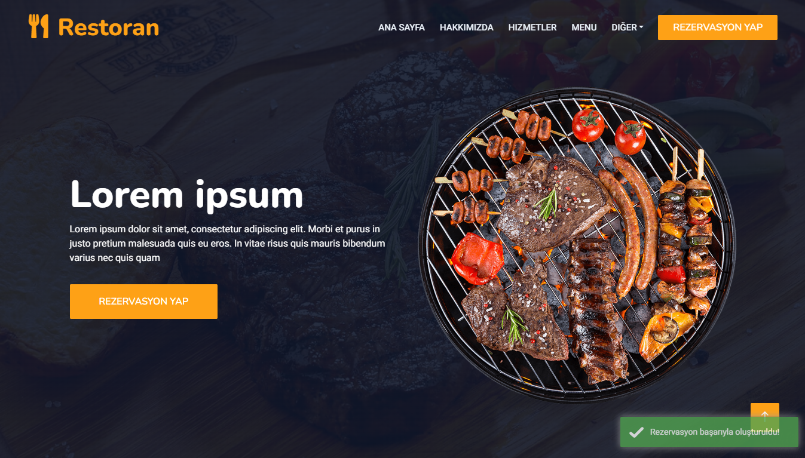

# Proje Detayı
Bu proje Asp.Net kullanılarak geliştirilmiş bir Restoran tanıtım sitesidir. Sayfadaki her öğe dinamik haldedir.
## Kullanılan Teknolojiler
- ASP.NET
- Sql
- Entity Framework Code First
- MVC
- Generic Repository
- View Component
- Identity
- Auto Mapper
- Toastr

## Ekran Görüntüleri

